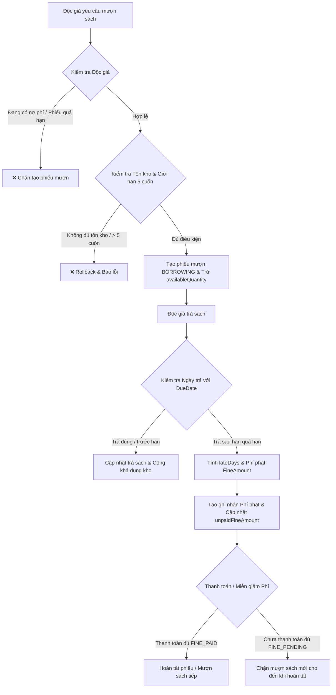

# 📚 DemoBookForLease - Hệ Thống Quản Lý Mượn Trả Sách & Tính Phí Phạt

[](https://www.oracle.com/java/)
[](https://spring.io/projects/spring-boot)
[](https://www.thymeleaf.org/)
[](https://getbootstrap.com/)
[](LICENSE)

**DemoBookForLease** là ứng dụng Web quản lý thư viện và mượn/trả sách server-side rendering xây dựng trên nền tảng **Spring Boot MVC**, **Thymeleaf**, **Spring Data JPA** và **H2/MySQL Database**. 

Ứng dụng đáp ứng trọn vẹn nghiệp vụ quản lý mượn trả sách thực tế: hỗ trợ mượn nhiều đầu sách, trả sách từng phần, tự động tính toán phí phạt quá hạn dựa trên chính sách linh hoạt (`FinePolicy`), thanh toán nợ phí nhiều lần (`FinePayment`), miễn giảm phí phạt (`FineWaiver`), kiểm soát tồn kho realtime và chặn độc giả nợ phí mượn thêm sách.

---

## 📋 Mục Lục

1. [Mục Tiêu & Tính Năng Chính](#-mục-tiêu--tính-năng-chính)
2. [Công Nghệ Sử Dụng](#-công-nghệ-sử-dụng)
3. [Quy Trình & Nghiệp Vụ Cốt Lõi](#-quy-trình--nghiệp-vụ-cốt-lõi)
4. [Sơ Đồ Thực Thể (ER Diagram) & Trạng Thái](#-sơ-đồ-thực-thể-er-diagram--trạng-thái)
5. [Cấu Trúc Thư Mục Dự Án](#-cấu-trúc-thư-mục-dự-án)
6. [Hướng Dẫn Cài Đặt & Khởi Chạy](#-hướng-dẫn-cài-đặt--khởi-chạy)
7. [Danh Sách Đường Dẫn (Routes & Endpoints)](#-danh-sách-đường-dẫn-routes--endpoints)
8. [Kiểm Thử & Chạy Tests](#-kiểm-thử--chạy-tests)

---

## 🎯 Mục Tiêu & Tính Năng Chính

### 📖 1. Quản lý Danh mục & Đầu sách
- **Quản lý Danh mục (`Category`)**: Thêm, sửa, chuyển đổi trạng thái ẩn/hiện danh mục.
- **Quản lý Sách (`Book`)**: Thêm mới, chỉnh sửa thông tin sách, tác giả, ISBN, giá mượn, tiền cọc, tổng số lượng (`totalQuantity`) và số lượng khả dụng (`availableQuantity`).
- **Lọc & Phân trang**: Tìm kiếm sách theo tên, tác giả hoặc danh mục.

### 👤 2. Quản lý Độc giả
- Quản lý thông tin độc giả (`Member`), thông tin liên hệ và trạng thái (`ACTIVE`, `INACTIVE`, `SUSPENDED`).
- Theo dõi lịch sử mượn trả và tự động cập nhật số tiền nợ phí phạt của độc giả.

### 📝 3. Nghiệp vụ Mượn Sách (Borrowing)
- Cho phép chọn 1 độc giả mượn **nhiều đầu sách** cùng lúc trong 1 phiếu mượn.
- **Ràng buộc nghiệp vụ chặt chẽ**:
  - Mỗi độc giả mượn tối đa **5 cuốn sách** đang chưa trả tại một thời điểm.
  - Không được tạo phiếu trùng sách (`bookId` trùng nhau trong 1 phiếu).
  - Tự động kiểm tra số lượng tồn kho còn lại (`availableQuantity >= requestedQuantity`).
  - **Chặn mượn sách**: Nếu độc giả đang có phiếu quá hạn (`OVERDUE`) hoặc chưa thanh toán hết nợ phí phạt (`unpaidFineAmount > 0`).
- Giảm số lượng tồn kho khả dụng `availableQuantity` của từng sách nguyên tử trong cùng transaction (`@Transactional`).

### 🔄 4. Trả Sách & Trả Từng Phần (Returns & Partial Returns)
- Hỗ trợ trả **toàn bộ** hoặc **trả từng phần** số lượng sách theo từng đầu sách trong phiếu.
- Tự động cộng trả lại `availableQuantity` tương ứng vào kho.
- Kiểm tra tính hợp lệ: Không cho phép trả quá số lượng đang mượn.
- Trả đúng/trước hạn: Không phát sinh phí phạt.
- Trả sau ngày hạn (`dueDate`): Tự động tính toán số ngày trễ và phí phạt phát sinh tại thời điểm trả.

### 💰 5. Cấu hình & Tự động Tính Phí Phạt (Fine Policy & Calculation)
- **Cấu hình Phí Phạt (`FinePolicy`)**:
  - Quy định phí trễ từng ngày (`dailyFineAmount`), trần phí phạt tối đa (`maxFineAmount`), và số ngày ân hạn (`graceDays`).
  - Đảm bảo duy nhất 1 policy được kích hoạt (`active = true`) tại một thời điểm.
- **Công thức tính phí phạt**:
  $$\text{lateDays} = \max(0, \text{actualReturnDate} - \text{dueDate} - \text{graceDays})$$
  $$\text{fineAmount} = \min(\text{maxFineAmount}, \text{lateDays} \times \text{returnedQuantity} \times \text{dailyFineAmount})$$

### 💳 6. Thanh toán & Miễn giảm Phí Phạt
- **Thanh toán phí phạt (`FinePayment`)**: Cho phép ghi nhận thanh toán một phần hoặc toàn bộ số nợ phí phạt. Cập nhật số tiền nợ còn lại (`unpaidFineAmount`).
- **Miễn giảm phí phạt (`FineWaiver`)**: Cho phép quản trị viên nhập số tiền miễn giảm, người duyệt và lý do miễn giảm chính đáng.

### 📊 7. Báo cáo & Thống kê Quá hạn
- Trích xuất danh sách độc giả mượn quá hạn (`GET /reports/overdue`).
- Hiển thị chi tiết số ngày trễ, danh sách các đầu sách chưa trả và tổng số tiền phí phạt dự kiến.

---

## 🛠 Công Nghệ Sử Dụng

| Nhóm | Công nghệ | Chi tiết |
| :--- | :--- | :--- |
| **Backend Framework** | Java 17, Spring Boot 3.3.4 | Spring MVC, Spring Data JPA, Hibernate ORM, Bean Validation |
| **Frontend / UI** | Thymeleaf, Bootstrap 5.3, FontAwesome | Layout Dialect, Responsive Design, CSS Custom Cards & Tables |
| **Database** | H2 Database (In-memory) | Cấu hình sẵn sàng chuyển đổi sang MySQL / PostgreSQL |
| **Build & Tools** | Apache Maven, Maven Wrapper (`mvnw`) | Quản lý phụ thuộc và đóng gói ứng dụng WAR / JAR |
| **Testing** | JUnit 5, Mockito | Viết unit test cho `BorrowingService`, `FineCalculatorService` |

---

## 🔄 Quy Trình & Nghiệp Vụ Cốt Lõi



---

## 🗄 Sơ Đồ Thực Thể (ER Diagram) & Trạng Thái

### Các Trạng Thái Phiếu Mượn (`BorrowingStatus`):
- `BORROWING`: Đang mượn, chưa trả hết sách.
- `PARTIALLY_RETURNED`: Đã trả một phần sách trong phiếu.
- `RETURNED`: Đã trả toàn bộ sách.
- `OVERDUE`: Đang quá hạn mượn chưa trả hết.
- `FINE_PENDING`: Đã trả sách nhưng còn nợ phí phạt chưa thanh toán đủ.
- `FINE_PAID`: Đã thanh toán đầy đủ phí phạt phát sinh.
- `CANCELLED`: Phiếu mượn đã bị hủy.

---

## 📁 Cấu Trúc Thư Mục Dự Án

```
demoBookForLease/
├── src/
│   ├── main/
│   │   ├── java/org/example/demobookforlease/
│   │   │   ├── config/              # Khởi tạo dữ liệu mẫu (DataInitializer)
│   │   │   ├── controller/          # Spring MVC Controllers & GlobalExceptionHandler
│   │   │   ├── dto/                 # Form Data Transfer Objects & Report DTOs
│   │   │   ├── exception/           # Custom BusinessException & ResourceNotFoundException
│   │   │   ├── model/               # JPA Entities (Book, Member, Borrowing, FinePolicy,...)
│   │   │   ├── repository/          # Spring Data JPA Repositories
│   │   │   ├── service/             # Business Logic & Transaction Services
│   │   │   └── DemoBookForLeaseApplication.java
│   │   └── resources/
│   │       ├── application.properties
│   │       └── templates/           # Giao diện Thymeleaf (books, borrowings, members,...)
│   └── test/
│       └── java/org/example/demobookforlease/
│           ├── service/             # Unit tests cho BorrowingService & FineCalculatorService
│           └── DemoBookForLeaseApplicationTests.java
├── mvnw & mvnw.cmd                  # Maven Wrapper Scripts
├── pom.xml                          # Maven POM File
└── README.md
```

---

## 🚀 Hướng Dẫn Cài Đặt & Khởi Chạy

### Yêu cầu môi trường:
- **JDK**: Java 17 trở lên.
- **Maven**: 3.8+ (Hoặc sử dụng `mvnw` đi kèm dự án).

### Các bước khởi chạy:

1. **Clone dự án hoặc mở thư mục dự án**:
   ```bash
   git clone <repository-url>
   cd demoBookForLease
   ```

2. **Khởi chạy ứng dụng bằng Maven Wrapper**:
   - **Trực tiếp qua Maven**:
     ```bash
     ./mvnw spring-boot:run
     ```
   - **Trân Windows PowerShell / CMD**:
     ```cmd
     .\mvnw.cmd spring-boot:run
     ```

3. **Truy cập ứng dụng**:
   - Giao diện chính: [http://localhost:8080](http://localhost:8080)
   - H2 Database Console: [http://localhost:8080/h2-console](http://localhost:8080/h2-console)
     - **JDBC URL**: `jdbc:h2:mem:bookdb`
     - **User Name**: `sa`
     - **Password**: *(Để trống)*

---

## 📌 Danh Sách Đường Dẫn (Routes & Endpoints)

| Chức năng | Route URL | HTTP Method | Mô tả |
| :--- | :--- | :---: | :--- |
| **Trang chủ** | `/` | `GET` | Bảng điều khiển (Dashboard) thống kê tổng quan |
| **Danh sách Sách** | `/books` | `GET` | Tìm kiếm, xem danh sách & tồn kho sách |
| **Thêm / Sửa Sách** | `/books/new`, `/books/{id}/edit` | `GET / POST` | Form tạo mới hoặc cập nhật thông tin sách |
| **Danh sách Độc giả** | `/members` | `GET` | Xem danh sách độc giả & trạng thái nợ phí |
| **Tạo Phiếu Mượn** | `/borrowings/new` | `GET / POST` | Chọn độc giả, chọn nhiều sách và ngày hẹn trả |
| **Danh sách Phiếu** | `/borrowings` | `GET` | Xem & lọc danh sách phiếu mượn theo trạng thái |
| **Chi tiết Phiếu** | `/borrowings/{id}` | `GET` | Xem chi tiết mượn, phí phạt & lịch sử thanh toán |
| **Trả Sách** | `/borrowings/{id}/return` | `GET / POST` | Trả toàn bộ hoặc từng phần sách, tính phí phạt |
| **Thanh toán Phí** | `/borrowings/{id}/payments/new` | `GET / POST` | Nộp tiền thanh toán phí phạt quá hạn |
| **Miễn giảm Phí** | `/borrowings/{id}/waivers/new` | `GET / POST` | Tạo phiếu miễn giảm phí phạt |
| **Cấu hình Phí phạt** | `/fine-policies` | `GET / POST` | Cấu hình mức phí mỗi ngày, ngày ân hạn & trần phí |
| **Báo cáo Quá hạn** | `/reports/overdue` | `GET` | Xem thống kê các phiếu mượn quá hạn |

---

## 🧪 Kiểm Thử & Chạy Tests

Ứng dụng được bao phủ bởi các Unit Test cho nghiệp vụ quan trọng (mượn sách, trả sách từng phần, tính phí phạt quá hạn, kiểm tra giới hạn nợ):

Chạy toàn bộ suite test bằng lệnh:
```bash
.\mvnw.cmd test
```

---

## 📝 Giấy Phép & Tác Giả
- **Phát triển bởi**: Team FPT Aptech / Spring Boot Developer
- **Giấy phép**: MIT License
